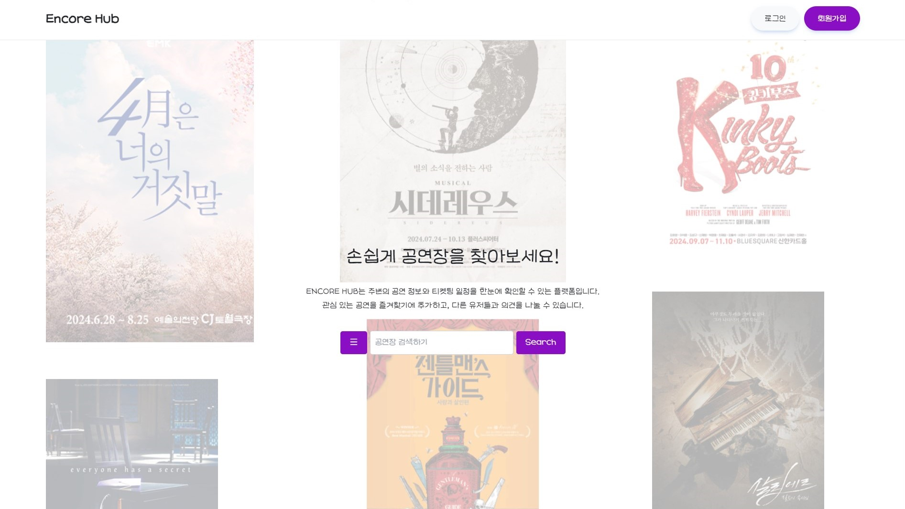

<!--

**Here are some ideas to get you started:**

🙋‍♀️ A short introduction - what is your organization all about?
🌈 Contribution guidelines - how can the community get involved?
👩‍💻 Useful resources - where can the community find your docs? Is there anything else the community should know?
🍿 Fun facts - what does your team eat for breakfast?
🧙 Remember, you can do mighty things with the power of [Markdown](https://docs.github.com/github/writing-on-github/getting-started-with-writing-and-formatting-on-github/basic-writing-and-formatting-syntax)
-->
> 2024 동북권 이노베이션캠프 - 팀 프로젝트(6조)
# Encore Hub 공연 정보 알림 서비스

## 🎓 Developers
| FE | FE | BE | BE | BE | BE |
| --- | --- | --- | --- | --- | --- |
|  |  |  |  |  |  |
| 김노을 | 류영찬 | 김도한 | 권기용 | 박서희 | 유성재 |
| [@noeulgim](https://github.com/noeulgim) | [@codingkunst](https://github.com/codingkunst) | [@straycat2](https://github.com/straycat2) | [@kwonkiyong0059](https://github.com/kwonkiyong0059) | [@seohee-P](https://github.com/seohee-P) | [@k278a](https://github.com/k278a) |

## 🌐 Encore-Hub Domain : <a href="https://encorehub.vercel.app" target="_blank">"https://encorehub.vercel.app"</a>

## 🛠️ Skill

 

## 💥 트러블슈팅

## 📄 Git Commit Convention
| 태그 이름 | 설명 |
| --- | --- |
| FEAT | 새로운 기능을 추가할 경우 |
| FIX | 버그를 고친 경우 |
| DESIGN | CSS 등 사용자 UI 디자인 변경 |
| !BREAKING CHANGE | 커다란 API 변경의 경우 |
| !HOTFIX | 급하게 치명적인 버그를 고쳐야하는 경우 |
| STYLE | 코드 포맷 변경, 세미 콜론 누락, 코드 수정이 없는 경우 |
| REFACTOR | 프로덕션 코드 리팩토링 |
| COMMENT | 필요한 주석 추가 및 변경 |
| DOCS | 문서를 수정한 경우 |
| TEST | 테스트 추가, 테스트 리팩토링(프로덕션 코드 변경 X) |
| CHORE | 빌드 태스트 업데이트, 패키지 매니저를 설정하는 경우(프로덕션 코드 변경 X) |
| RENAME | 파일 혹은 폴더명을 수정하거나 옮기는 작업만인 경우 |
| REMOVE | 파일을 삭제하는 작업만 수행한 경우 |
